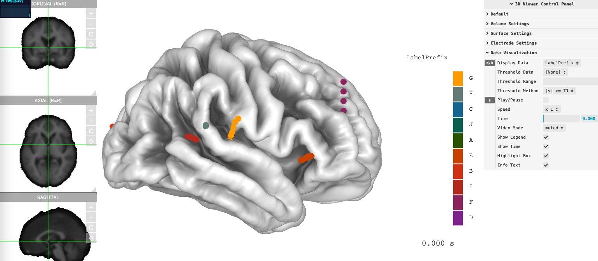

## Installation

### Install from `pypi`:

```sh
# Bare minimal
pip install threebrainpy
```

## Simple example

Launch Python with your favorite editor, run the following Python commands. If you don't have `FreeSurfer` installed, replace `path` with any fs subject. If you don't have any, go to [sample templates](https://github.com/dipterix/threeBrain-sample/releases){:target="_blank"} and download one.

```py
import os
from threebrainpy.core import Brain

# You can replace `path` with any FreeSurfer-generated subject folder
path = os.path.join(os.environ["FREESURFER_HOME"], "subjects", "fsaverage")

brain = Brain(os.path.basename(path), path)
brain.add_slice("brain")
brain.add_surfaces("pial")
brain.render()
```

## Example: add electrodes

Easiest way to add electrodes is via a `csv` table. Here is [a toy-example table](https://github.com/dipterix/threeBrainPy/blob/main/docs/showcase-viewer/electrodes.csv){:target="_blank"}. A bare-minimal table should contain at lease 5 columns (case-sensitive!):

|     Electrode       |       T1R       |       T1A       |       T1S       |       Label       |
|---------------------|-----------------|-----------------|-----------------|-------------------|
| `int` (start from 1)  | `float` (T1 MRI R)| `float` (T1 MRI A)| `float` (T1 MRI S)| `str`               |

Other coordinate systems are also supported. See [documentation](api-core-brain.md#threebrainpy.core.brain.Brain.add_electrodes){:target="_blank"} for details:

* `Coord_x`, `Coord_y`, `Coord_z`: coordinates in `fsaverage` RAS space (tkrRAS)
* `T1R`, `T1A`, `T1S`: coordinates in `T1` MRI space (scanner RAS)
* `MNI305_x`, `MNI305_y`, `MNI305_z`: coordinates in `MNI305` space
* `MNI152_x`, `MNI152_y`, `MNI152_z`: coordinates in `MNI152` space


```py
# Read electrodes.csv from github
electrode_path = "https://raw.githubusercontent.com/dipterix/threeBrainPy/main/docs/showcase-viewer/electrodes.csv"
brain.add_electrodes(table=electrode_path)
```

> You can pass the `pandas` dataframe to `brain.add_electrodes` as well. For example, 

```py
import pandas as pd
table = pd.read_csv(electrode_path)
brain.add_electrodes(table=table)
```

## Example: add iEEG data

The easiest way to add iEEG data is via a `csv` table. Here is [a toy-example table](showcase-viewer/electrodes.csv){:target="_blank"}. A bare-minimal table should contain at lease 2 columns:

|     Electrode       |       Data (you can rename it)       |
|---------------------|--------------------------------------|
| `int` (electrode name)| `float` or `str` (data value)             |

Other key-columns are:

* Subject (used when you have multiple subjects)
* Time (used when you have animation)

> You must add electrodes first before setting contact values. Otherwise, the values will be dropped.

```py
# brain.add_electrodes(table=table)
value_path = "https://raw.githubusercontent.com/dipterix/threeBrainPy/main/docs/showcase-viewer/electrodes.csv"
brain.set_electrode_values(value_path)
brain.render()
```

A complete [documentation is here](api-core-brain.md#threebrainpy.core.brain.Brain.set_electrode_values){:target="_blank"}.




