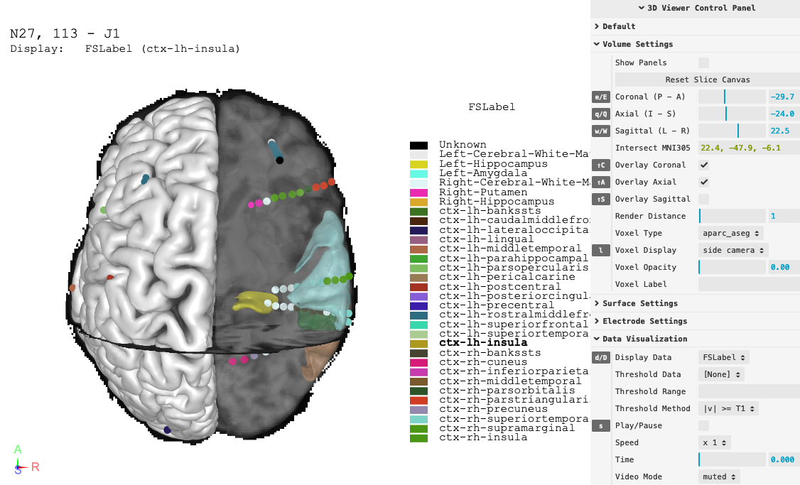

# Welcome to `threebrainpy`

`threebrainpy` is a Python package that visualizes MRI, CT, FreeSurfer surfaces, and iEEG electrodes in web browsers. See the parent projects via:

* [RAVE (Reproducible Analysis and Visualization for iEEG)](https://rave.wiki/){:target="_blank"}
* [YAEL (Your Advanced Electrode Localizer)](https://yael.wiki/){:target="_blank"}

[Check out the live demo!](showcase-viewer){:target="_blank"}

{:target="_blank"}
